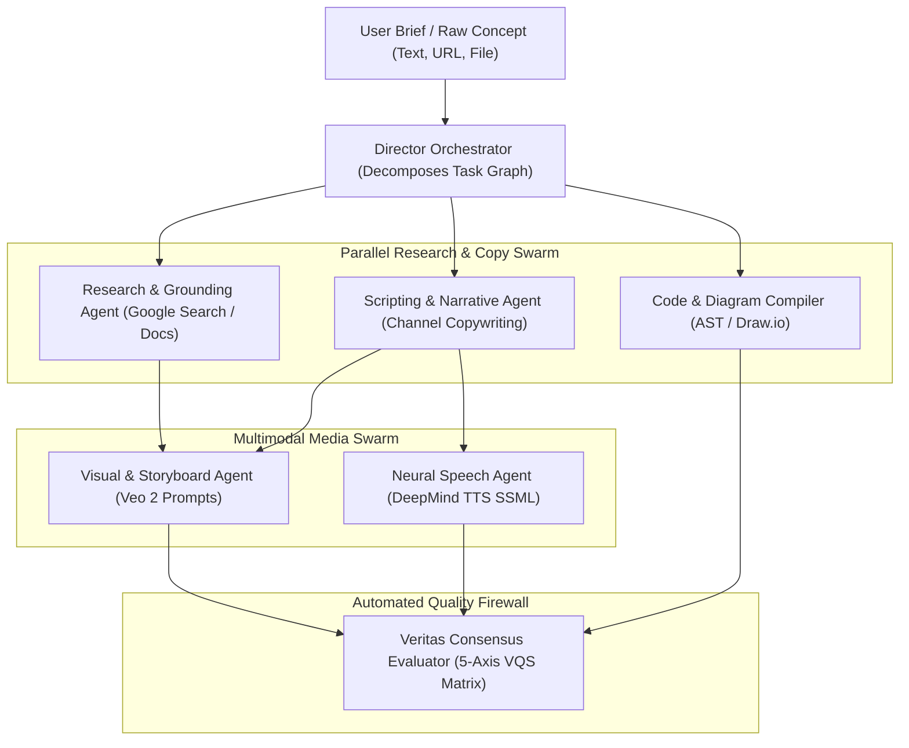
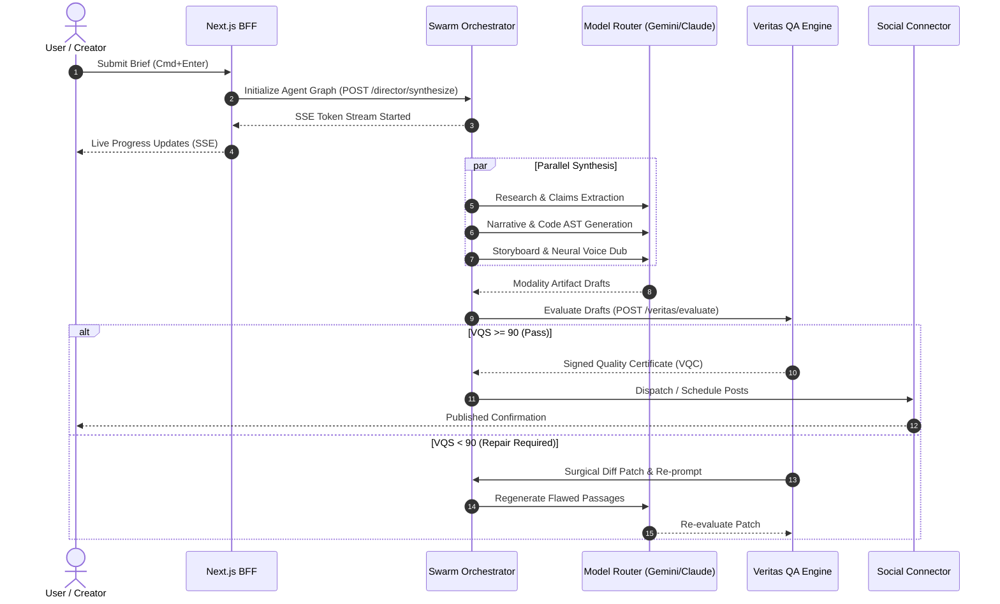

# AI-001 — AI & Agent Swarm Architecture

| Metadata Attribute | Value |
| :--- | :--- |
| **Document ID** | AI-001 |
| **Title** | Zyvoriq Multi-Agent Swarm Orchestration & Agentic Graph Architecture |
| **Owner** | Lead AI Architect |
| **Approvers** | CTO, VP of AI Research |
| **Version** | 1.0.0 |
| **Status** | Approved |
| **Priority** | P0 |
| **Created Date** | 2026-08-23 |
| **Last Reviewed Date** | 2026-08-23 |
| **Quality Gate** | QG-AI-01 (AI Architecture Approved) |
| **Assurance Score** | 99/100 |
| **Parent Reference** | STR-001, PRD-000, ARC-001 |

---

## 1. Agent Swarm Decomposition & Dependency Graph

---

## 2. Multi-Agent Inter-Service Sequence Flow

---

## 2. Specialized Agent Roles & System Prompts

1. **Research & Grounding Agent**: Extracts structured claims, dates, statistics, and citations from provided URLs and documents.
2. **Narrative & Editorial Agent**: Drafts long-form copy, social hooks, and scripts conforming to active persona tone vectors.
3. **Storyboard & Visual Agent**: Generates structured video scene prompts, camera angles, color grading tokens, and on-screen captions.
4. **Neural Speech Agent**: Produces SSML markup with pitch, cadence, and breath markers for 5-band neural voice generation.
5. **Code & Architecture Agent**: Writes validated executable code and generates standard Draw.io/SVG XML architecture topology graphs.

---

## 3. Document Sign-off (QG-AI-01)

- [x] Multi-agent roles and state machine graph formally specified.
- [x] Inter-agent message protocols and telemetry streaming verified.

**Exit Status:** `AI ARCHITECTURE APPROVED (PASS)`
