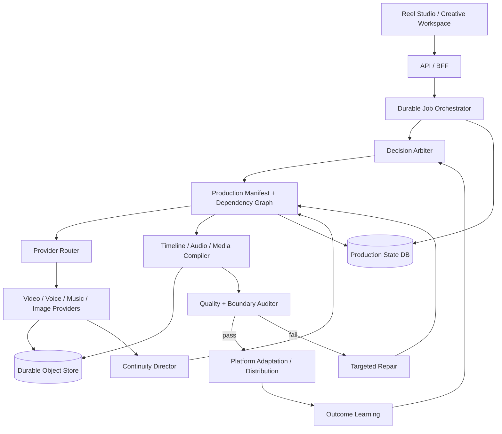

# ARC-001 — High-Level Design & System Architecture

| Attribute | Value |
| :--- | :--- |
| Document ID | ARC-001 |
| Owner | Principal System Architect |
| Version | 2.0.0 |
| Status | Active |
| Priority | P0 |
| Parents | STR-001, BUS-001, PRD-000, NFR-001 |
| Detailed Control Plane | ARC-005 |

## 1. Architecture principles

1. **Production Manifest is the source of truth.** Generated files are artifacts referenced by semantic production state.
2. **Durable asynchronous execution.** Long media jobs persist state and resume; request lifetimes do not own production lifetimes.
3. **Provider independence.** Video, voice, music, image and reasoning providers sit behind stable interfaces and routing policy.
4. **Audio/timeline ownership.** Zyvoriq owns the master clock, editorial cuts, audio stems and final render.
5. **Continuity as state.** Character, environment, object, action, camera and emotional state move through a dependency graph.
6. **Quality after assembly.** Provider success is not final quality; the assembled master and every cut boundary are audited.
7. **Smallest-unit repair.** Invalid dependency closures are repaired without mutating locks/unaffected work.
8. **Evidence-based completion.** `READY` requires artifacts plus applicable gates.
9. **Tenant and memory isolation.** Creator/brand/audience intelligence is scoped and policy-controlled.

## 2. High-level topology

## 3. Core responsibilities

### Client / Studio

Creates real jobs, displays persisted status, edits semantic project state, applies locks and renders previews. Simulated previews must be visibly distinct from generated masters.

### Durable orchestrator

Owns state transitions, retries, idempotency, checkpointing, dependency-aware parallelism, provider timeout/failover and resume behavior.

### Decision Arbiter

Resolves creative, evidence/risk, policy and economics constraints according to the Zyvoriq Constitution. It does not expose hidden model chain-of-thought; user-facing explanations are concise decision rationales/evidence.

### Production Manifest

Owns semantic intent, timeline, shot graph, continuity, assets, locks, provider provenance, QA, repair lineage and final masters.

### Provider Router

Selects providers based on task fit, quality telemetry, reference support, reliability, cost, latency, privacy, residency, rights/policy and capacity. Provider-specific metadata is retained without leaking into the canonical semantic contract.

### Continuity Director

Maintains cross-shot state and conditions dependent generation using references where supported. Independent B-roll remains parallelizable.

### Media compiler

Probes actual source duration/format, applies trims, frame-rate/resolution normalization, intentional transitions, caption/graphics composition and owned audio mixing. It must not rely on hard-coded clip offsets.

### Quality / Repair

Runs deterministic technical checks plus specialized multimodal evaluation on assets, boundaries and full masters. Blocking failures prevent `READY`. Repair invalidates only affected downstream nodes.

## 4. Persistence domains

Minimum durable entities:

- workspace / identity scope;
- project;
- production manifest version;
- job/run and stage attempts;
- provider request/result;
- immutable asset and media probe metadata;
- continuity state/reference;
- QA assessment/gate evidence;
- repair action;
- approval;
- final master/variant;
- outcome telemetry.

## 5. Security/privacy architecture

- workspace/tenant authorization on every persisted resource;
- encrypted transport and storage using platform-managed strong encryption;
- secret/provider credentials outside source control;
- explicit external-provider data policy per route;
- scoped memories and brand isolation;
- untrusted uploads/URLs treated as adversarial input;
- audit trail for material changes and publishing actions.

Specific algorithm/cipher/product claims must reflect deployed infrastructure rather than documentation aspiration.

## 6. Deployment rule

Production-generated media may use temporary local scratch space during processing, but the canonical artifact must be persisted to durable storage before a stage can advance to `ARTIFACT_READY`/later states.

## 7. Detailed specification

[ARC-005](ARC-005_Creative_OS_Control_Plane.md) defines continuity, audio ownership, long-form assembly, state semantics and repair invariants. Traceability is governed by [GOV-002](../governance/GOV-002_Traceability_Model.md).
