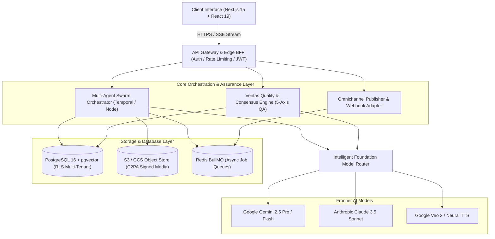
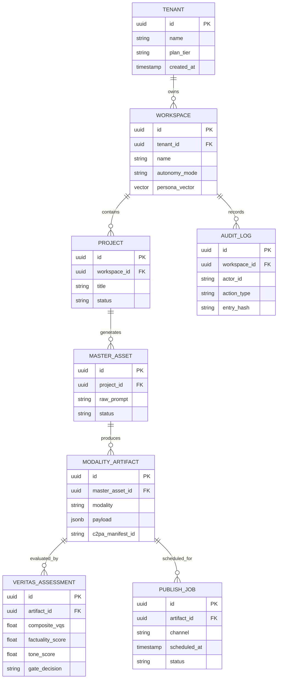

# ARC-001 — High-Level Design (HLD) & System Architecture

| Metadata Attribute | Value |
| :--- | :--- |
| **Document ID** | ARC-001 |
| **Title** | Zyvoriq Platform High-Level Architecture & System Design |
| **Owner** | Principal System Architect |
| **Approvers** | CTO, VP of Engineering, Security Officer, SRE Lead |
| **Version** | 1.0.0 |
| **Status** | Approved |
| **Priority** | P0 |
| **Created Date** | 2026-08-23 |
| **Last Reviewed Date** | 2026-08-23 |
| **Quality Gate** | QG-HLD-01 (Architecture Approved) |
| **Assurance Score** | 98/100 |
| **Parent References**| STR-001, BUS-001, PRD-000, NFR-001 |

---

## 1. Architectural Philosophy & Principles

1. **Decoupled Asynchronous Swarm**: Long-running multimodal generations execute via durable event queues with optimistic client streaming.
2. **Deterministic Quality Firewalls**: Generation pipelines must pass through the **Veritas Verification Engine** before touching storage or distribution adapters.
3. **Multi-Model Polyglot Routing**: No hard dependency on a single foundation model provider. Workloads route dynamically based on modality, cost, speed, and safety characteristics.
4. **Zero-Trust Multi-Tenancy**: Data access is strictly partitioned by `tenant_id` and `workspace_id` enforced via cryptographic sessions and DB Row-Level Security (RLS).

---

## 2. End-to-End System Topology

---

## 3. Subsystems & Core Service Responsibilities

### 3.1 Next.js 15 BFF & Client Layer
- **Role**: Serves the responsive desktop/mobile UI, handles Edge SSR/SSG, authenticates JWT sessions, and streams real-time agent output directly to client state.
- **Tech Stack**: Next.js 15.4 (App Router), React 19, Tailwind CSS, Lucide React.

### 3.2 Multi-Agent Swarm Orchestrator
- **Role**: Coordinates parallelized generation subtasks:
  - *Research Agent*: Scrapes URLs, queries knowledge vault, extracts key statistics.
  - *Scripting Agent*: Writes narrative scripts tailored to channel constraints.
  - *Visual Engine*: Generates image prompts, storyboards, and video scene specs.
  - *Audio Engine*: Generates neural speech manifests with emotional dynamic ranges.
  - *Code Compiler*: Validates syntax, runs AST linting, and renders vector diagrams.
- **Resilience**: Durable task execution with automatic retry policies and state persistence.

### 3.3 Veritas Quality & Assurance Engine
- **Role**: Acts as an automated quality firewall.
- **Evaluation Flow**:
  1. Pulls generated asset drafts and grounding source data.
  2. Dispatches parallel evaluation prompts to independent models (Gemini 2.5 Pro + Claude 3.5 Sonnet).
  3. Computes the composite **Veritas Quality Score (VQS)**.
  4. Triggers auto-repair regeneration if score falls below required threshold.

### 3.4 Media Synthesis & C2PA Provenance Pipeline
- **Role**: Compiles raw media tokens into production assets (MP4 video rendering, WAV/MP3 audio concatenation, SVG diagram rendering).
- **Provenance**: Injects cryptographic C2PA metadata manifest containing creator signature, timestamp, and model hash.

### 3.5 Omnichannel Distribution Worker
- **Role**: Manages authenticated social OAuth tokens, formats API payloads, schedules publishing times, and handles rate-limit retries.

---

## 4. Canonical Data Model (ERD)

---

## 5. Security & Threat Modeling

1. **Authentication & Authorization**: Session validation using ironclad JWTs with rotating refresh tokens and workspace-scoped RBAC (`Owner`, `Editor`, `Viewer`, `Auditor`).
2. **Prompt Injection & Model Jailbreak Defense**: Input sanitization pre-flight layer scans all user-supplied briefs for adversarial injection patterns before passing to agent swarms.
3. **Data Egress Protection**: Customer data is strictly encrypted at rest (AES-GCM-256) and in transit (TLS 1.3). Zero customer data is retained for upstream model training.

---

## 6. Architecture Quality Gate Sign-off (QG-HLD-01)

- [x] Clear service boundaries with decoupled asynchronous queues.
- [x] Multi-model router prevents single-provider vendor lock-in.
- [x] Complete data model and entity relationships documented.
- [x] Security, tenant isolation, and failure recovery protocols defined.

**Exit Status:** `ARCHITECTURE APPROVED (PASS)`
