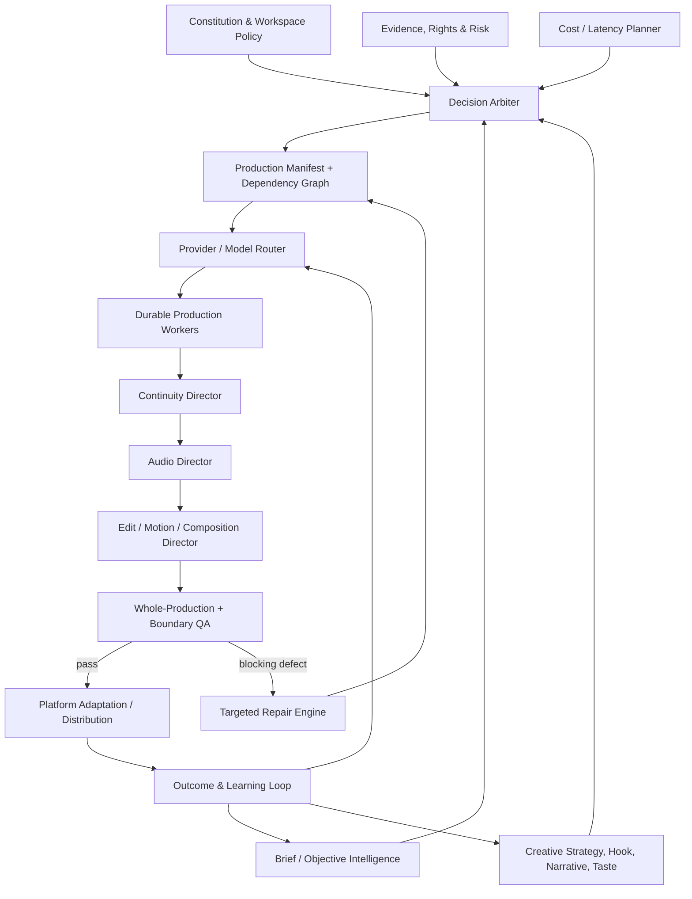

# ARC-005 — Creative OS Control Plane & Production Architecture

| Attribute | Value |
| :--- | :--- |
| Document ID | ARC-005 |
| Owner | Principal Architect |
| Status | Active |
| Priority | P0 |
| Parents | PRD-000, ARC-001, NFR-001 |

## 1. Architectural objective

Zyvoriq is a model-agnostic creative control plane. Foundation models generate candidate artifacts; Zyvoriq owns intent, state, continuity, editorial structure, quality, repair, economics and learning.

The canonical runtime object is the **Production Manifest**. Provider responses are immutable assets referenced by the manifest, never the project source of truth.

## 2. Control plane

## 3. Production Manifest contract

Minimum domains:

- objective, audience, platform, creator/brand context;
- master script and structured claims;
- characters, environments, objects, emotional arc and camera grammar;
- master timeline and audio clock;
- shots with editorial duration distinct from provider generation duration;
- `continuityIn` and `continuityOut` state;
- immutable generated assets plus trim/select instructions;
- voice, music, SFX, ambience, captions and graphics tracks;
- dependency graph, locks and version lineage;
- provider/model provenance and usage rights metadata;
- per-shot, per-boundary and whole-production QA;
- repair history and final masters.

## 4. Long-form continuity invariant

A long video is one production timeline rendered from many assets, not a concatenation of independent clips.

For speech-led productions:

1. Finalize narration text.
2. Generate the master narration.
3. Obtain real waveform-derived word/phoneme timing where supported.
4. Detect editorial beats.
5. Plan shots to those beats.
6. Generate source clips in provider-supported units such as 4/6/8 seconds.
7. Trim source clips to arbitrary editorial durations.
8. Carry continuity state between dependent shots.
9. Mix continuous music/ambience beneath the entire timeline.
10. Audit the assembled master and every boundary.

Estimated timing may be used for planning, but may not be labeled verified synchronization.

## 5. Continuity graph

Each continuity-sensitive shot carries state for:

- character identity and body attributes;
- hair, wardrobe and accessories;
- environment, lighting and time;
- object positions and state;
- pose, action, motion vector and screen direction;
- camera framing, angle, lens intent and motion;
- emotional state and gesture energy.

When a provider supports reference conditioning, the selected prior end frame/reference is passed to the next dependent shot. Independent B-roll remains parallelizable.

## 6. Audio ownership

Canonical stems:

- narration/dialogue;
- music;
- SFX;
- ambience.

No generated video clip owns the production's final audio by default. Native clip audio is explicitly accepted, muted, replaced or mixed. The final master mix controls loudness, ducking, transitions and continuity.

## 7. Editorial ownership

The Edit Director owns trims and transition semantics. Source-generation boundaries are not assumed to be editorial boundaries. Transition choice may include hard cut, cut-on-action, match cut, J/L cut, whip, dip, dissolve, graphic transition or no transition. There is no universal crossfade rule.

## 8. Quality and repair

Quality is multidimensional, not a single self-reported score. Required P0 checks include:

- artifact existence and decodability;
- duration/timeline validity;
- visual/identity/object/action continuity;
- speech intelligibility and A/V synchronization;
- caption timing/readability;
- music/ambience continuity and loudness;
- semantic visual ↔ narration consistency;
- whole-story coherence;
- platform constraints;
- explicit boundary checks around each cut.

A failed component invalidates the smallest dependency closure necessary for repair. Locked artifacts and semantics remain immutable.

## 9. Durable state machine

Canonical production states:

`PLANNING → SCRIPT_READY → AUDIO_GENERATING → AUDIO_READY → SHOTS_PLANNED → VIDEO_GENERATING → ROUGH_CUT_READY → MIXING → MASTER_RENDERING → AUDITING → REPAIRING → APPROVAL_REQUIRED → READY`

`FAILED` is reachable from any executable state. Retries resume from persisted checkpoints; they do not restart completed independent work.

## 10. Storage and execution

Production assets require durable object storage. Application-local filesystem paths may be used only for local development/cache, never as the sole production record. Long-running jobs require persisted state, idempotency keys, retry policies, leases/heartbeats, provider timeout handling, and resumability.

## 11. Provider independence

Provider selection is a policy decision over quality, task fit, continuity/reference support, latency, price, privacy, residency, safety, rights, rate limits and historical acceptance. Provider changes must not require rewriting the Production Manifest.

## 12. Regression invariants

- No empty asset URL may satisfy an artifact gate.
- No planned stage may be returned as completed.
- No source clip may be stretched beyond its usable duration without an explicit transformation.
- No repair may silently mutate a locked field.
- No removed node may leave a dangling dependency.
- No master may be `READY` while a blocking gate is unresolved.
