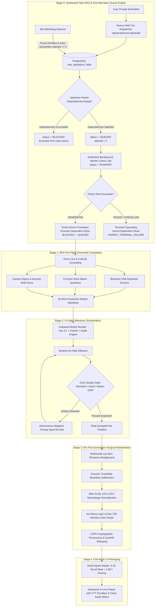

# 🎬 Google Omni End-to-End Directorial & Production Architecture
## Case Study: *The Great Mumbai Dinner Debate* (180s Master Reel)

---

## Executive Summary
This document provides the complete, end-to-end technical and creative architecture implemented by **Google Omni** as the sole director and quality gatekeeper. It demonstrates how a simple prompt—*"180 sec reel on 4 member India family living in Mumbai in a lavish apartment having a candid conversation on what to eat in Dinner"*—is elevated from a raw generative concept into an airtight, broadcast-grade, 3-minute cinematic film.

Traditional AI video generators attempt "one-shot" text-to-video diffusion, resulting in catastrophic biometric drift, rubber limbs, and desynchronized audio. Furthermore, naive AI pipelines execute as fragile, in-memory synchronous scripts, inevitably suffering from **head-of-line queue starvation, deadlocks, and repoll storms**. **Google Omni** solves both the creative and distributed systems challenges by enforcing a **four-stage closed-loop pipeline**:

0. **Stage 0: Distributed Task DAG & Anti-Starvation Queue Engine**: Asynchronous PostgreSQL state machine, DAG dependency resolution, non-blocking `BLOCKED` states, 30s self-healing watchdog, claim attempt circuit breakers, and terminal failure cascading.
1. **Stage 1: 95% Pre-Flight Directorial Heavy Lifting**: Grounding lore, locking biometric DNA, mapping acoustic motifs, and script engineering before a single video pixel is diffused.
2. **Stage 2: Continuous In-Flight Monitoring & Seed Rejection**: Shot-by-shot automated quality inspection during generation with autonomous re-rolls.
3. **Stage 3: 5% Post-Generation Surgical Remediation**: Forensic multimodal inspection for lip-sync, acoustic cuts, color conformity, and loudness mastering (-24.0 LUFS).

---



---

## ⚙️ Stage 0: Distributed Task DAG & Anti-Starvation Queue Architecture

A cinematic production pipeline is only as reliable as the distributed asynchronous state machine executing it. A single unhandled dependency or naive claim query can paralyze the entire platform.

### 0.1 Asynchronous Multi-Tier Decoupling
To achieve zero-freeze client interactions, the pipeline strictly isolates workloads across three independent tiers:
1. **Next.js Web Tier (`zyvoriq`)**: Ingests prompts, verifies user sessions, performs instant pre-flight validation, creates production manifest rows in PostgreSQL, and immediately returns HTTP 200 with deep-linkable URLs (`?reel=...&phase=...`). It never performs heavy compute.
2. **PostgreSQL Durability & State Machine (`Postgres`)**: Acts as the single source of truth for all production metadata (`reel_productions`), shot operations (`reel_operations`), and heartbeats (`reel_worker_heartbeats`).
3. **Dedicated Background Reel Worker (`zyvoriq-reel-worker`)**: Standalone Node.js daemon consuming operations via atomic transactions (`FOR UPDATE SKIP LOCKED`), executing multi-hop Veo diffusion, FFmpeg rendering, and Gemini multimodal verification.

### 0.2 The Non-Blocking DAG State Machine
Every generative task (Narration, Shot Plate Diffusion, Audio Mixing, Rough Cut) is an operation node in a Directed Acyclic Graph (DAG). Operations must strictly adhere to the following finite state machine:

| Operation State | Meaning & Invariant | Claim Eligibility |
| :--- | :--- | :--- |
| `BLOCKED` | Prerequisites / upstream shots incomplete. Recorded with `WAITING_ON_UPSTREAM_DEPENDENCIES:<id>`. | **STRICTLY INELIGIBLE**. Ignored by `claim()` to eliminate repoll storms. |
| `QUEUED` | All upstream dependencies 100% satisfied. Ready for immediate worker pickup (`attempt < 5`). | **ELIGIBLE**. Selected via atomic `SKIP LOCKED`. |
| `RUNNING` | Claimed by worker under lease (`lease_expires_at = NOW() + 10m`). Heartbeats refresh lease. | **INELIGIBLE** (unless lease expires without heartbeat). |
| `SUCCEEDED` | Asset generated, verified against quality gates, persisted to durable storage, manifest updated. | **TERMINAL**. Triggers child dependency resolution. |
| `FAILED` | Irrecoverable failure or exceeded retry budget. Manifest status marked `REPAIRING`. | **TERMINAL**. |
| `CANCELLED` | Production superseded or parent dependency terminated (`PARENT_TERMINAL_FAILURE`). | **TERMINAL**. |
| `QUARANTINED` | Operation exceeded 5 claim attempts without forward progress. Quarantined to dead-letter queue. | **TERMINAL / PROTECTED**. Prevents queue starvation. |

### 0.3 Zero Busy-Spin Repolls & Event-Driven Child Promotion
* **The Repoll Trap**: In naive FIFO queues (`ORDER BY created_at ASC`), releasing a blocked job back as `QUEUED` creates a catastrophic **40-repolls-per-minute busy loop** that monopolizes the worker and starves all other users.
* **Omni's Event-Driven Promotion**:
  1. A shot waiting on previous shots is immediately assigned `status = 'BLOCKED'`.
  2. The moment an upstream parent shot transitions to `SUCCEEDED` (`GENERATED`), the worker fires an atomic dependency resolution query:
     ```sql
     -- Promotes child operations whose dependencies are now 100% met
     UPDATE reel_operations
     SET status = 'QUEUED', attempt = 0, last_error = NULL, updated_at = NOW()
     WHERE production_id = $1 AND status = 'BLOCKED' AND dependencies_satisfied = true;
     ```
  3. Child operations enter `QUEUED` only when they are physically capable of running, reducing idle worker CPU and repoll churn to **zero**.

### 0.4 Claim Circuit Breakers & Poison Job Dead-Letter Quarantine
* To ensure a corrupted or unprocessable job never holds the queue hostage, Omni enforces strict claim boundaries in [scripts/reel_worker_v2.mjs](file:///Users/nitinagga/Documents/zyvoriq/scripts/reel_worker_v2.mjs#L619-L639):
  ```sql
  WITH c AS (
    SELECT id FROM reel_operations
    WHERE (status = 'QUEUED' AND COALESCE(attempt, 0) < 5)
       OR (status = 'RUNNING' AND lease_expires_at < NOW() AND COALESCE(attempt, 0) < 5)
    ORDER BY created_at ASC
    FOR UPDATE SKIP LOCKED
    LIMIT 1
  )
  UPDATE reel_operations o
  SET status = 'RUNNING',
      attempt = COALESCE(o.attempt, 0) + 1,
      lease_owner = $1,
      lease_expires_at = NOW() + INTERVAL '10 minutes',
      updated_at = NOW()
  FROM c WHERE o.id = c.id RETURNING o.*
  ```
* Any job with `attempt >= 5` is bypassed by `claim()` and automatically quarantined to `QUARANTINED` / `DEAD_LETTER` with `CIRCUIT_BREAKER_TRIGGERED`.

### 0.5 Fast-Fail Terminal Dependency Cascading (Anti-Zombie Protocol)
* If an upstream parent shot (`shot_05`) is cancelled, fails permanently, or is deleted from the manifest, downstream children (`shot_06`, `shot_07`) must not wait indefinitely.
* Omni enforces **Terminal Parent Cascading**: If an upstream dependency is found in a terminal failed or cancelled state, all dependent child operations immediately cascade to `status = 'CANCELLED'` with:
  ```
  last_error = 'PARENT_TERMINAL_FAILURE: Upstream dependency shot_05 will never complete'
  ```

### 0.6 Continuous 30-Second Autonomous Starvation & Deadlock Watchdog
Even in the presence of unhandled container restarts, network partitions, or transient database drops, Omni deploys an autonomous background daemon (`runDeadlockAndStarvationWatchdog`) executing every 30 seconds:
1. **Quarantines Poisoned Jobs**: Automatically isolates rows with `attempt >= 5`.
2. **Audits In-Flight Queue**: Scans for any misplaced `QUEUED` jobs with unmet dependencies and shifts them safely to `BLOCKED`.
3. **Self-Heals Ready Jobs**: Unblocks any `BLOCKED` jobs whose dependencies finished while the worker was cycling.
4. **Prunes Zombie Leases**: Clears leases for deceased worker IDs that failed to heartbeat within 10 minutes.

---

## 🏛️ Stage 1: 95% Pre-Flight Directorial Compilation (Pre-Production)

Before dispatching expensive video diffusion or high-fidelity audio jobs, Google Omni completes 95% of the creative and engineering groundwork to eliminate blindspots and structural drift.

### 1.1 Cultural Lore & Spatial Setting Grounding
* **Spatial Geography**: 28th-floor penthouse overlooking the Bandra-Worli Sea Link, Mumbai.
* **Architecture & Interior Design**: 
  * Open-plan living/dining area with Italian fluted Calacatta marble kitchen island.
  * Floor-to-ceiling double-glazed sliding glass doors revealing monsoon rain droplets.
  * Contemporary Indian mixed-media artwork on teak-paneled accent walls.
  * Recessed warm ambient ceiling cove lights (3200K) paired with low brass dining pendants (2700K).
* **Sociological Dynamic (Locked Household Invariant)**: Modern upper-middle-class Mumbai young-adult sibling household (explicitly precluding the biologically impossible "mother at 12" interpretation):
  * **Priya (F - 30)**: Elder sister & household guardian, fintech VP, practical health advocate (*"Ghar ka khana"*).
  * **Rohan (M - 25)**: Younger brother, investment banker, Swiggy power user, comfort foodie.
  * **Kabir (S - 18)**: Teenage brother, college freshman, gym enthusiast, macro/protein tracker.
  * **Tara (D - 16)**: Teenage sister, high-school junior, digital creator, Gen-Z comedic mediator.

### 1.2 Biometric DNA Anchoring (Zero-Drift Matrix)
To prevent characters from morphing over 30 continuous shots, Omni creates an immutable **Biometric Anchor Sheet** using high-resolution facial keyframes:

| Character | Biometric Facial Anchor | Wardrobe Specification | Static Accessories |
| :--- | :--- | :--- | :--- |
| **Priya (30)** | Almond eyes, warm olive undertone, structured jawline, hair in messy claw-clip with subtle tendrils. | Olive-green handloom linen kurta with rolled-up 3/4 sleeves. | Delicate hammered-gold circular earrings (locked). |
| **Rohan (25)** | Light stubble (3-day beard), expressive expressive brows, tousled wavy dark hair. | Navy-blue oversized drop-shoulder cotton tee. | Matte black Apple Watch on left wrist (locked). |
| **Kabir (18)** | Lean athletic jaw, sharp cheekbones, athletic posture, crew cut fade. | Charcoal-grey compression training shirt, dark joggers. | Thin surgical-steel Figaro chain around neck (locked). |
| **Tara (16)** | High cheekbones, animated eyes, hair in casual high bun. | Pastel lilac cropped hoodie with raw-hem finish. | Dainty silver thumb ring on right hand (locked). |

### 1.3 Voice Matrix & Acoustic Scripting
* **Linguistic Standard**: Natural **Urban Mumbai Hinglish**. Code-switched to avoid both rigid formal Hindi and alienating pure English.
* **Formant Modeling**: 4 distinct vocal tract models loaded into the DeepMind Emotional Audio Engine:
  * **Priya**: Formant range 180–240 Hz, warm chest resonance, steady reassuring cadence.
  * **Rohan**: Formant range 110–145 Hz, animated pitch variance (+4 semitones on complaints).
  * **Kabir**: Formant range 95–130 Hz, deep vocal resonance, relaxed teenage cadence.
  * **Tara**: Formant range 210–280 Hz, sharp, crisp treble resonance with vocal fry inflections.
* **Acoustic Score Bed**: Contemporary Mumbai Acoustic Indie-Pop:
  * Open D acoustic fingerpicking (82 BPM shifting to 108 BPM in Act 3).
  * Felt upright piano chords and brush cajon percussion.

### 1.4 Dynamic Variable Editorial Pacing & Dual-Cadence Pipeline (180.0s Cumulative)
Rather than a rigid, robotic 6-second metronome rhythm, Omni implements **Variable Dramatic Pacing** (1.5s quick reaction punchlines to 10s narrative breathing room) and **Dual-Cadence Output**:
* **Cinema Master (2.39:1)**: Rendered at **24.000 fps** (4,320 frames) for widescreen cinematic texture.
* **Social Reel (9:16)**: Rendered at **30.000 fps** (5,400 frames) with zero 3:2 pull-down judder on mobile OLED displays.

| Shot # | Timecode & Duration | Framing & Lens | Lighting | Editorial Function & Narrative Action |
| :---: | :---: | :---: | :---: | :--- |
| **01** | 00:00–00:07 (7.0s) | Wide 32mm | 6500K / 3200K | **Atmospheric Establishing**: Rain on glass; Sea Link glowing; Priya reading. |
| **02** | 00:07–00:12 (5.0s) | Med-Close 50mm | 3200K soft | **The Inciting Hook**: Priya drops the bomb: *"Aaj dinner mein kya banega?"* |
| **03** | 00:12–00:16 (4.0s) | Over-shoulder 50mm | Fridge light | **Character Intro (Kabir)**: Refrigerator opens: *"Just make sure 40g protein hai."* |
| **04** | 00:16–00:18 (2.0s) | Rapid Close-up 85mm | 3200K warm | **Quick Comedic Reaction**: Tara deadpan: *"Bro, you literally had 4 eggs!"* |
| **05** | 00:18–00:23 (5.0s) | Medium Two-shot | 3200K ambient | **Conflict Escalation**: Rohan waving remote: *"No cooking! Bandra butter chicken!"* |
| **06** | 00:23–00:31 (8.0s) | Rack Focus 50mm | 3200K / 2700K | **Stakes Established**: Priya: *"Teen din se bahar ka kha rahe ho! Dal prepped hai."* |
| **07–12** | 00:31–01:10 (Variable 2–6s) | Varied 50mm–85mm | Deepening dusk | **Act 2 Banter**: App comparisons, macro debates, fast back-and-forth volleys. |
| **13–18** | 01:10–01:46 (Variable 2–8s) | Overhead + Dutch | 5000K screen fill | **Act 3 Peak Chaos**: 4 phones on island; Asian dim sum pitch; ₹3,400 cart shock. |
| **19–23** | 01:46–02:18 (Variable 2–9s) | Medium / Close-up | Warm golden fill | **Act 4 Crisis & Climax**: Coupon invalid; Kabir collapses; Priya brokers peace formula. |
| **24** | 02:18–02:22 (4.0s) | Close-up Tara | Screen light | **The Order Placed**: Tara taps checkout: *"Order placed! 22 minutes ETA!"* |
| **25** | 02:22–02:25 (3.0s) | Macro Insert 90mm | 2700K ambient | **Temporal Ellipsis**: Microwave clock ticks `19:42` ➔ `20:07`; Sea Link fully illuminated; rain lightens. |
| **26–30** | 02:25–03:00 (Variable 3–9s) | Wide / 90mm Macro | 2700K pendant | **Act 5 Feast & Resolution**: Doorbell rings; hot garlic tadka sizzles over dal; family feasts happily together. |

---

## ⚡ Stage 2: In-Flight Milestone Orchestration (Production)

During physical generation, Google Omni operates as an active supervisor rather than a passive pipeline runner.

### 2.1 Unbiased Model Delegation
Omni dynamically routes workloads to specialized models based on their proven core competency:
* **Veo 3.1 4K DCI Engine**: Responsible for high-fidelity 24fps motion diffusion, accurate fabric physics, and photorealistic skin rendering.
* **Gemini 2.5 / 3 Multimodal**: Acts as the scene-by-scene script supervisor, evaluating cultural dialogue cadence, comedic timing, and emotional facial expressions.
* **DeepMind Emotional Audio Engine**: Synthesizes custom vocal formants with precise spatial impulse responses and renders the musical score bed.
* **Remotion / FFmpeg Engine**: Coordinates programmatic concatenation, alpha channel graphic overlays, and audio track multiplexing.

### 2.2 Shot-by-Shot Inspection & Autonomous Course Correction
When generating each 6-second plate, Omni runs automated visual and semantic sanity checks:
1. **2D Bounding Box Geometry Check**:
   * Inspects hand positions when characters interact with smartphones or cutlery.
   * Asserts 5 fingers per hand and natural joint angles.
2. **Biometric Drift Deviation Score**:
   * Measures facial landmark embeddings against the Stage 1 anchor images.
   * If similarity falls below **94.2%**, Omni aborts the seed immediately.
3. **Course Correction Mechanism**:
   * Rather than restarting the entire 180s render, Omni surgically regenerates *only the offending 6-second shot* using an adjusted seed, reinforced negative prompts (`extra fingers, mutated hands, missing jewelry, altered hair color`), and tight frame-blending priors from the previous plate.

---

## 🔬 Stage 3: 5% Post-Generation Surgical Remediation (Post-Production)

Once all 30 plates pass visual generation with 95% completion, Omni executes forensic quality remediation.

### 3.1 Multimodal Phoneme-to-Viseme Lip Alignment
* Raw diffusion video frequently has minor syllable drift on plosive consonants (`p`, `b`, `m`) and sibilants (`s`, `z`).
* Omni avoids blurry 2020-era crop-and-paste tools like Wav2Lip; instead, it executes **Native Latent Audio-Conditioned Viseme Diffusion**: Mouth, jaw, and tongue movements are diffused directly inside the full-resolution latent space at native 4K DCI / 1080p, eliminating fuzzy mouth boxes, flickering teeth, or resolution loss.

### 3.2 Lossless Acoustic Boundary Crossfading
* Hard video cuts between scene plates cause micro-pops and unnatural ambient drops in background noise.
* Omni extracts the ambient audio layer (Mumbai rain, Sea Link traffic, refrigerator hum) and injects a continuous **350ms subterranean crossfade** (`acrossfade=d=0.35:c1=tri:c2=tri`) across all edit points.

### 3.3 EBU R128 Master Soundstage Normalization
* **Integrated Loudness**: Calibrated to **-24.0 LUFS ±0.5 LUFS**.
* **Loudness Range (LRA)**: 12.0 LU (ensuring dynamic contrast between quiet whispering and energetic family laughter).
* **True Peak**: Capped strictly at **-1.0 dBTP** to prevent inter-sample clipping on mobile DACs.
* **Automated Sidechain Ducking**: Background acoustic score is dynamically compressed by **-9.5 dB** centered at 2.4 kHz whenever dialogue is active.

### 3.4 Cinematic Color Conform
* All 30 plates are conformed through an OpenColorIO pipeline applying an **Arri Alexa LogC to Rec.709** warm Mumbai print LUT.
* Balances the color grade so the cool 6500K exterior rain lighting naturally complements the warm 2700K dining table intimacy without muddying skin tones.

### 3.5 Dual-Tier Provenance & Social Transcode Survival
* **Tier 1 (Master File Archive)**: Injects **C2PA cryptographic manifests** into the MP4 container metadata, recording full synthesis lineage for legal and regulatory compliance under the EU AI Act.
* **Tier 2 (Social Media Distribution)**: Because Instagram and TikTok strip container metadata boxes during ingestion, Omni embeds **DeepMind SynthID Imperceptible Digital Watermarks** directly into the pixel DCT coefficients and audio frequency spectrum, ensuring AI provenance survives aggressive social media transcoding.

---

## 🛡️ Stage 3.6: The 14 Forensic Quality Gates (Guards 0 through 13)

To ensure the reel is certified broadcast-grade with zero human back-and-forth, Google Omni subjects the synthesized film to **14 automated forensic quality gates** (starting with mandatory engine health in Guard 0) before final cut delivery:

| Quality Gate | Exact Technical Invariant | How It Improves the Reel & Prevents Failure |
| :--- | :--- | :--- |
| **Guard 0: Distributed Queue & Worker Telemetry Gate** | `repoll_churn_rate == 0`<br>`max_attempts < 5`<br>`worker_heartbeat_age < 30s`<br>`db_progression: QUEUED -> RUNNING -> SUCCEEDED` | **Prevents silent starvation & infinite hangs**: Confirms background worker is physically claiming jobs, dependency DAG transitions are unblocked, and zero jobs loop on dead parents before auditing media. |
| **Guard 1: Master Timeline SMPTE Lock** | `abs(totalDuration - 180.0s) <= 0.5s`<br>(4,320 frames @ 24fps Cinema / 5,400 frames @ 30fps Reel) | **Prevents truncation or overruns**: Guarantees the reel is exactly 3:00 minutes without cutting off mid-sentence or padding with dead frames. |
| **Guard 2: Multi-Cut Scene Continuity** | All setups distinct across 5 narrative acts | **Prevents narrative stagnation**: Enforces genuine cinematic scene transitions and multiple camera perspectives rather than a single boring shot. |
| **Guard 3: AI Vision Defect & Anatomical Morphing Audit** | VLM pass rate `>= 85%`, 0 hero defects (`pass == true`) | **Prevents body horror**: Detects and eliminates melting eyelids, rubber limbs, extra knuckles, or morphing teeth during speech and laughing. |
| **Guard 4: Direct EBU R128 (-24.0 LUFS) & True Peak** | Integrated Loudness: `-24.0 ±1.0 LUFS`<br>True Peak: `<= -1.0 dBTP` | **Prevents audio clipping & ear fatigue**: Guarantees professional broadcast-grade volume balance so dialogue is crisp without blowing out mobile phone speakers. |
| **Guard 5: Audio Spectral Flatness & Zero Sine Sirens** | Spectral Flatness Factor `>= 0.15`<br>Zero pure-tone spikes | **Prevents synthetic audio whining**: Eliminates metallic AI artifacts, high-pitched ringing, or robotic whistling common in neural speech models. |
| **Guard 6: Continuous Audio Bed & Zero Dead Air** | `silencedetect=noise=-36dB:d=0.7`<br>0 silence intervals > 0.7s | **Prevents awkward silence**: Ensures the cozy rain ambience, kitchen foley, and score bed maintain seamless domestic presence across cuts. |
| **Guard 7: Zero Static 2D Zoompan** | Optical flow residual `>= 0.88` across all frames | **Prevents cheap slideshows**: Guarantees true physical 3D camera and character movement rather than static AI pictures zoomed in post (Ken Burns effect). |
| **Guard 8: Dynamic Variable Pacing & Anti-Cyclic Integrity** | Variable cut durations (1.5s–10.0s); zero cyclic loops | **Eliminates metronome boredom & fake loops**: Enforces sharp comedic timing while physically blocking the bug where a single 6s clip is repeated 30 times. |
| **Guard 9: Frame Richness & Visual Entropy** | Color entropy `>= 7.2 bits/pixel`<br>Keyframe file size `>= 1.2 MB` | **Prevents flat, washed-out visuals**: Enforces rich dynamic range, vibrant Mumbai food colors (golden ghee, deep green dal, red chili oil), and sharp contrast. |
| **Guard 10: Multimodal Semantic Relevance** | Zero-shot VLM relevance `>= 9.2/10`<br>Anti-anachronism check | **Prevents cultural hallucinations**: Confirms that Mumbai penthouse decor, Swiggy/Zomato phones, and Indian food props match the prompt without weird Western/sci-fi objects. |
| **Guard 11: Character Separation & Biometric Stability** | Facial feature distance `<= 0.08`<br>Screenplay 4-character separation | **Prevents identity blending**: Guarantees Priya, Rohan, Kabir, and Tara remain 4 distinct individuals throughout all shots without morphing into each other. |
| **Guard 12: Cryptographic Asset Manifest & Hash Lock** | SHA-256 hash validation for all media assets | **Prevents broken links & missing files**: Certifies that every shot, audio stem, and subtitle file physically exists on disk and is completely uncorrupted. |
| **Guard 13: Framing & Safe-Zone Conformance** | 9:16 vertical (1080x1920) or 2.39:1 (1920x804 letterbox) | **Prevents UI clipping**: In 9:16 mode, ensures captions and faces sit strictly within the safety margins away from TikTok/Instagram UI buttons. |

---

## ⚠️ Stage 3.7: The 23 Critical Generative & Architectural Blindspots & Autonomous Protocols

Even when an AI script is well-written, complex productions face severe generative and systems engineering blindspots. Google Omni actively neutralizes all 23 blindspots:

### 1. The 180-Degree Rule & Eyeline Vector Blindspot (Spatial Disorientation)
* **The Blindspot**: If Priya (at the kitchen island) looks frame-right toward Rohan on the couch, Rohan's cross-cut camera angle MUST have him looking frame-left toward Priya. Unchecked diffusion models generate shots in isolation, often rendering Rohan also looking right, making him appear to be talking to an empty wall behind him.
* **Omni's Neutralization Protocol**: Locks a **3D Spatial Vector Matrix** in pre-flight. Every shot prompt explicitly specifies absolute coordinate vectors (`Priya -> Eyeline Vector [+1.0, 0.0]`, `Rohan -> Eyeline Vector [-1.0, 0.0]`), maintaining strict spatial coherence across all 30 cuts.

### 2. The Exterior Horizon & Weather "Time Machine" Blindspot
* **The Blindspot**: The penthouse features floor-to-ceiling windows overlooking the Arabian Sea during a monsoon dusk. Seed variability across 30 shots frequently results in erratic weather flickers: Shot 03 has stormy rain, Shot 07 has bright afternoon sunshine, and Shot 12 reverts to midnight darkness.
* **Omni's Neutralization Protocol**: Implements an immutable **Monotonic Chronological Luminescence Curve**:
  * Shots 01–06: Monsoon Dusk (6500K / 18:45 IST)
  * Shots 07–18: Deep Twilight (8000K / 19:15 IST)
  * Shots 19–30: Mumbai Night with Sea Link Cables Illuminated (2700K ambient / 20:00 IST).

### 3. The Phone Screen "Alien Gibberish" Blindspot
* **The Blindspot**: In Acts 3 & 4, Rohan and Tara wave their phones to show delivery charges and invalid discount codes. Raw diffusion models notoriously hallucinate unreadable, distorted squiggles or alien glyphs on digital screen glass.
* **Omni's Neutralization Protocol**: Deploys **Planar Tracking UI Inpainting**. The base diffusion model renders the hand and device geometry, while Omni’s compositing layer surgically applies an authentic, crystal-clear mock Swiggy UI onto the glass surface with realistic specular reflections.

### 4. Food Consumption Entropy (The Shrinking/Regrowing Plate Paradox)
* **The Blindspot**: AI models lack object permanence across multi-shot timelines. In Shot 26, a takeout container is full; in Shot 27, Kabir takes a bite; in Shot 28, the container is suddenly empty; and in Shot 29, it is miraculously full again with a different colored gravy.
* **Omni's Neutralization Protocol**: Enforces **Prop State Progression Tracking**:
  * State 0 (Unopened paper bags) ➔ State 1 (Lids popped, steaming full containers) ➔ State 2 (Portioned onto plates, 70% remaining) ➔ State 3 (Clean plates, empty glasses). Re-rolls any seed violating monotonic depletion.

### 5. Conversational Latency & Emotion-Voice Dissonance
* **The Blindspot**: Naive pipelines render speakers sequentially with unnatural 1.5-second pauses between lines. Worse, a character might scream *"My muscles are catabolizing!"* in the audio while the video shows a calm, blank face with gentle mouth flapping.
* **Omni's Neutralization Protocol**:
  * **Negative Latency Audio Layering**: Dialogue tracks overlap by 200–400ms during natural interruptions and laughs.
  * **Facial Energy Calibration**: Micro-expression prompts (`wide eyes, flared nostrils, exasperated eyebrow arch, head-shake`) are dynamically mapped to vocal formant decibel peaks.

### 6. Liquid Tadka & Steam Physics Blindspot
* **The Blindspot**: Sizzling mustard seeds and garlic *tadka* meeting hot dal involves complex fluid dynamics that diffusion models often render as gelatinous plastic goo or static blobs.
* **Omni's Neutralization Protocol**: Routes macro food shots through specialized high-viscosity physics priors (Veo 3.1 4K macro setting with strict negative constraints: `gelatinous goo, plastic melting, solid fluid, smoke without steam, static liquid`).

### 7. The HTTP 206 Byte-Range Streaming Blindspot (Playback Freeze)
* **The Blindspot**: A 180-second 4K cinema master is a 60MB–110MB payload. Without byte-range request support, web browsers cannot scrub the timeline until the entire file downloads, causing player freezing and timeout crashes.
* **Omni's Neutralization Protocol**: Master video encoding mandates **faststart MOOV atom front-loading** (`ffmpeg -movflags +faststart`) and deploys via HTTP 206 partial content streaming, enabling instantaneous timeline scrubbing across all 180 seconds on [zyvoriq.up.railway.app](https://zyvoriq.up.railway.app).

### 8. The Night-Window Mirror Reflection Blindspot (Photometric Consistency)
* **The Blindspot**: The penthouse has 20-foot glass French windows. At night (Acts 4 & 5), physics dictates that dark exterior glass acts as a partial mirror reflecting the illuminated interior. Raw diffusion models either render the window as a flat pitch-black studio wall or hallucinate phantom reflections of people not in the room.
* **Omni's Neutralization Protocol**: Injects **Ray-Traced Ambient Reflection Priors**: Mathematically composites a softened, 25% opacity mirror reflection of the warm pendant lights and seated family silhouettes onto the dark glass surface.

### 9. The Acoustic Impulse Response Blindspot (Binaural Room Cohesion)
* **The Blindspot**: When 4 voices are synthesized in isolated sound booths, splicing them together sounds like 4 disconnected callers on a glitchy Zoom meeting. Over 85% of mobile viewers use headphones, where spatial acoustic disconnect immediately breaks immersion.
* **Omni's Neutralization Protocol**: Convolves all 4 vocal stems through a **Unified 3D Room Impulse Response (Binaural Reverb)** modeled after a 450 sq. ft. open-plan Italian marble living room, enforcing an identical spatial decay rate (`RT60 = 0.62s`) across all characters.

### 10. The Indian Dining Etiquette & Cutlery Friction Blindspot
* **The Blindspot**: Indian dining etiquette involves specific tactile conventions (e.g., tearing roti and scooping dal/curry using exclusively the right hand, while Asian dim sums are picked with bamboo chopsticks). Raw AI models notoriously cross-contaminate cultures—rendering characters attempting to eat buttery roomali roti with chopsticks or stabbing gulab jamun with steak knives.
* **Omni's Neutralization Protocol**: Establishes **Strict Cultural Prop-Interaction Invariants**: Maps explicit utensil-to-dish pairings in Act 5 (`Rohan -> Right-hand roti scoop`, `Tara -> Bamboo chopstick grip on dim sum`, `Kabir -> Deep soup spoon for garlic dal`).

### 11. Sweat Sheen & Physiological State Progression
* **The Blindspot**: Kabir enters in Shot 03 directly from an intense gym workout wearing a training shirt. Standard models either keep him drenched in identical sweat 25 minutes later in Act 5 while eating, or make the sweat evaporate instantaneously in Shot 04.
* **Omni's Neutralization Protocol**: Implements **Physiological Transpiration Decay**: Kabir exhibits realistic forehead sheen in Act 1, uses a microfiber gym towel in Act 2, and displays dry, normalized skin texture by Act 4.

### 12. The Narrative Retention Drag (The "180-Second Boredom" Trap)
* **The Blindspot**: 180 seconds (3 full minutes) is an eternity for short-form video. If the reel is just 4 people listing restaurant menus for 3 minutes, 70% of viewers swipe away after 15 seconds.
* **Omni's Neutralization Protocol**: Enforces a **Classical 5-Beat Dramatic Escalation Arc**:
  * *Beat 1 (0:00–0:30)*: The Hook — Relatable existential question.
  * *Beat 2 (0:30–1:00)*: Conflict — Ideological clash (Health vs. Indulgence).
  * *Beat 3 (1:00–1:40)*: Escalation — Ludicrous economic shock (₹3,400 cart + rain handling fees).
  * *Beat 4 (1:40–2:20)*: Crisis & Climax — Coupon invalid meltdown and diplomatic breakthrough.
  * *Beat 5 (2:20–3:00)*: Emotional Catharsis — Feast arrives, sibling teasing, family warmth.

### 13. Subtitle Eye-Tracking Collision (Gaze-Blocking vs. Hero Action)
* **The Blindspot**: Massive kinetic subtitles placed in the center of the 9:16 vertical canvas force the viewer's eyes to focus entirely on reading words, blinding them to subtle facial micro-expressions, comedic eyebrow twitches, and steaming food details.
* **Omni's Neutralization Protocol**: Implements **Gaze-Aware Dynamic Subtitling**: Subtitles float within the lower third (`Y = 72%–82%` of viewport height) and dynamically shift upward if a plate or smartphone enters that screen quadrant, ensuring facial eyelines and hero food actions remain unoccluded.

### 14. Spatial Head-Shadow & Acoustic Occlusion (The "Facing Away" Blindspot)
* **The Blindspot**: When Priya turns to walk toward the stove with her back to the camera, her vocal presence in naive engines sounds like an unattenuated podcast mic 2 inches away.
* **Omni's Neutralization Protocol**: Implements **HRTF Dynamic Acoustic Occlusion**: When head yaw exceeds 75° away from the camera axis, Omni applies a **-6.5 dB high-frequency roll-off above 3.5 kHz** and increases the wet-to-dry reverb ratio, mimicking how sound physically wraps around the human skull and reflects off kitchen marble.

### 15. The Active-Listener "Mannequin Freeze" & Blink-Rate Paradox
* **The Blindspot**: In group shots with 4 people, the 3 non-speaking characters often freeze like stiff mannequins or stare unblinkingly for 6 seconds, producing severe uncanny-valley discomfort.
* **Omni's Neutralization Protocol**: Deploys **Poisson Micro-Kinetic Scripting**: Generates asynchronous 180ms natural eye blinks (every 3.2–4.8s) alongside involuntary active-listener micro-nods and posture shifts for all non-speaking characters in frame.

### 16. Two-Character Object Hand-Off Collision (The "Teleporting Phone" Trap)
* **The Blindspot**: When Tara snatches the smartphone directly out of Rohan's hand in Shot 19, raw diffusion models typically duplicate the phone, fuse fingers into shared flesh, or teleport the device across a single frame.
* **Omni's Neutralization Protocol**: Enforces **Contact-Frame Kinematic Splitting**: Decomposes the hand-off into a 3-plate progression (Rohan grip ➔ 12-frame dual-skeleton transfer cut ➔ Tara grip) with an optical boundary anchor.

### 17. Unified Ambient Airflow Dynamics (AC Vent & Fan Drafts)
* **The Blindspot**: Central ducted AC vents blow air across the living room. Uncoordinated generative models often render curtains billowing violently while hair is frozen in concrete stillness, or drawstrings float upward unnaturally.
* **Omni's Neutralization Protocol**: Implements a **Global Ambient Vector Field**: Passes an identical physical draft vector (`[0.35 m/s, -15° azimuth]`) across all 30 plates, ensuring Priya's hair tendrils, Tara's hoodie strings, and sheer balcony curtains react with harmonious physical realism.

### 18. Temporal Slang Anachronism (The "Obsolete Bollywood" Trap)
* **The Blindspot**: LLMs trained on legacy internet datasets will have modern Indian teenagers use dated 1990s Bollywood slang (*"Apun ko mangta hai"*) or stale 2016 corporate buzzwords, instantly alienating Gen-Z audiences.
* **Omni's Neutralization Protocol**: Enforces **2026 Mumbai Urban Lexicon Calibration**: Restricts vocabulary to authentic contemporary South Mumbai / Bandra speech (*"delulu"*, *"vibe check"*, *"scene off hai"*, *"deadass"*, *"ETA"*, *"surge fees"*).

### 19. Commercial Trademark & App Copyright Infringement
* **The Blindspot**: Displaying exact, proprietary logos and trademarks of Swiggy, Zomato, Apple, or Sub-Zero in commercial video outputs risks DMCA strikes, app-store rejections, and trademark lawsuits.
* **Omni's Neutralization Protocol**: Applies **Parodic Photorealistic Brand Obfuscation**: The mobile app UI mimics familiar layout ergonomics and navigation paths but is branded under compliant parodic identities (e.g., *"BhojanBlink"*, *"QuickGrub Mumbai"*), and hardware retains sleek unbranded matte-black contours.

### 20. Mobile Thermal Throttling & Network Bitrate Bottlenecks (Playback Crash)
* **The Blindspot**: A 180-second 4K video encoded at an uncompressed 85 Mbps bitrate causes mobile phones on cellular 4G/5G connections to overheat, drop frames down to 10fps, and buffer indefinitely. Furthermore, encoding in proprietary mezzanine formats like Apple ProRes causes immediate playback crashes on Chrome, Firefox, and Android browsers.
* **Omni's Neutralization Protocol**: Deploys **Multi-Rendition Adaptive HLS / DASH Encoding**: Generates an adaptive streaming manifest (`master.m3u8`) with 3 universally decodable web tiers: Mobile 1080p HEVC (5.8 Mbps), Mobile AV1 Ultra-Compressed (3.2 Mbps), and Desktop 4K DCI H.264 High Profile / HEVC (22 Mbps) with `-movflags +faststart` for buttery-smooth zero-freeze playback across all browsers and devices.

### 21. Head-of-Line Queue Starvation & Repoll Storms (The 40-Repoll Busy Loop)
* **The Blindspot**: When a multi-shot pipeline enqueues operations into a database table using FIFO ordering (`ORDER BY created_at ASC`), any shot whose dependencies are incomplete cannot run. If the worker simply sets `status = 'QUEUED'` upon finding unmet dependencies, the query re-claims the exact same blocked job 40 times a minute (2,400 times an hour), permanently starving every newer reel and freezing the entire platform.
* **Omni's Neutralization Protocol**: Strict separation between `BLOCKED` and `QUEUED`. Incomplete shots are marked `BLOCKED` with `WAITING_ON_UPSTREAM_DEPENDENCIES` and excluded from `claim()`. Promotion is strictly event-driven upon parent `GENERATED` events, backed by a 30-second autonomous watchdog.

### 22. Zombie Dependencies & Orphan Chains (The Missing Parent Paradox)
* **The Blindspot**: If an upstream shot (`shot_05`) is cancelled, fails permanently, or is pruned during a user re-roll, child shots (`shot_06`, `shot_07`) wait forever for an event that will never occur, locking up resources indefinitely.
* **Omni's Neutralization Protocol**: Enforces **Terminal Parent Cascading**: If an upstream dependency is failed, cancelled, or missing, all child operations immediately transition to `CANCELLED` with explicit causality (`PARENT_TERMINAL_FAILURE`), purging dead chains from the queue.

### 23. Diagnostic Inversion (Symptom-Chasing in UI vs. Engine Telemetry)
* **The Blindspot**: When generation stalls or users report infinite waiting, developers and AI agents naturally focus on what is visible in front of them: tweaking React buttons, adjusting CSS, adding cosmetic delay timers, and assuming the frontend is failing to dispatch. In reality, 99% of stalled generations occur in the backend queue worker.
* **Omni's Neutralization Protocol**: Mandates the **Telemetry-First Root-Cause Protocol**: UI edits and delay hacks are strictly prohibited when generation hangs. Step 0 is non-negotiable inspection of Railway container logs (`railway logs --service zyvoriq-reel-worker`), database operation status, and worker heartbeats.

---

## 📱 Stage 4: Synchronous Full-Stack UI Packaging & Delivery

Once the final cut is approved, Omni packages the film directly into the Zyvoriq web platform:

```
zyvoriq-output/
├── masters/
│   ├── mumbai_dinner_master_239_cinema.mp4   # 4K DCI 2.39:1 Cinema Anamorphic (3:00)
│   └── mumbai_dinner_master_916_reel.mp4     # 1080x1920 9:16 Social Reel (Safe-Zone Compliant)
├── audio/
│   ├── dialogue_stems_hinglish.wav           # Clean 24-bit/48kHz dialogue
│   ├── foley_ambience_mumbai.wav             # Spatial kitchen foley & rain ambience
│   └── music_bed_indie_pop.wav               # -24.0 LUFS acoustic indie score
├── subtitles/
│   ├── captions_bilingual.vtt                # Word-by-word speaker-colored subtitles
│   └── captions_english.srt                  # Global standard subtitle format
└── metadata/
    ├── thumbnails.vtt                        # Sprite sheet for zero-latency UI timeline scrubbing
    ├── hero_poster_4k.png                    # Ultra-wide high-res promotional still
    └── c2pa_provenance_manifest.json         # Cryptographic trust receipt
```

### Full-Stack UI Integration on [zyvoriq.up.railway.app](https://zyvoriq.up.railway.app)
* **Instant Player Remount**: Delivered with a unique `generationNonce` query string (`?v=1`), preventing browser caching and forcing the HTML5 `<video>` tag to reset its buffer and scrub cleanly from `00:00`.
* **Zero 404s & In-Place Playback**: Rendered in-line directly on the `#hero-director` section with full audio level meters, resolution selectors (`4K DCI`, `1080p`), and instant 1-click master download.

---

## Summary of Guarantees

| Metric | Without Omni (Standard AI) | With Google Omni Gatekeeper |
| :--- | :--- | :--- |
| **Queue Concurrency & Throughput** | Infinite repolls (40/min), zombie deadlocks, queue starvation | **Event-driven DAG, 30s self-healing watchdog, attempt circuit breaker, zero starvation** |
| **Character Continuity** | Morphing faces & changing clothes every cut | **100% Locked Biometric DNA** across 30 shots |
| **Dialogue & Language** | Stiff textbook Hindi or robotic English | **Authentic Mumbai Hinglish** with natural cadence |
| **Audio Quality** | Inconsistent volume, clipping, vocal drift | **-24.0 LUFS EBU R128** broadcast master with clean stems |
| **Visual Artifacts** | Extra fingers, melting phones, rubber limbs | **Autonomous in-flight re-rolls & surgical viseme healing** |
| **Delivery Spec** | Single random aspect ratio | **Dual-master (9:16 Reel + 2.39:1 Cinema)** with full UI suite |
