# BUS-001 — Business Requirements Document (BRD)

| Metadata Attribute | Value |
| :--- | :--- |
| **Document ID** | BUS-001 |
| **Title** | Zyvoriq Platform Business Requirements Document |
| **Owner** | VP of Product / Business Operations |
| **Approvers** | Chief Product Officer, VP of Engineering, Head of QA |
| **Version** | 1.0.0 |
| **Status** | Approved |
| **Priority** | P0 |
| **Created Date** | 2026-08-23 |
| **Last Reviewed Date** | 2026-08-23 |
| **Quality Gate** | QG-BRD-01 (Business Approved) |
| **Assurance Score** | 97/100 |
| **Parent Strategy** | STR-001 (Product Vision & Principles) |

---

## 1. Executive Summary

This Business Requirements Document (BRD) details the market demand, functional business capabilities, regulatory guardrails, and commercial economics for **Zyvoriq**. Zyvoriq enables commercial enterprises, media studios, and technical creators to scale omnichannel multimodal content production while compressing cycle times from weeks to minutes and eliminating brand hallucination risk.

---

## 2. Business Problem & Opportunity

### 2.1 The Legacy Content Bottleneck
Enterprises spend an average of **$140,000 to $450,000 annually per brand line** coordinating cross-functional content production across siloed freelance networks and agencies. The current workflow suffers from:
1. **Prolonged Cycle Time**: 7–14 business days from initial brief to multi-channel deployment.
2. **Quality & Brand Inconsistency**: Fragmented handoffs between copywriters, motion designers, and audio engineers dilute brand voice.
3. **Severe AI Risk & Liability**: 64% of enterprise marketing leaders cite hallucination and copyright liability as top barriers to adopting AI generation at scale.
4. **Sub-optimal Distribution**: Campaigns are rarely adapted to channel-native best practices (e.g., aspect ratios, pacing, audio dynamics, platform hashtags).

### 2.2 Commercial Opportunity
By automating multi-agent generation with cryptographic **Veritas Quality Assurance** and **Autonomy Controls**, Zyvoriq captures market demand across high-growth segments:
- **Enterprise ARR**: $24k - $120k / year seat + usage licenses.
- **Prosumer / Creator MRR**: $49 - $249 / month subscriptions.

---

## 3. Business Objectives & Success Metrics

```
┌──────────────────────────────────────┬──────────────────────────────┬─────────────────────────┐
│ Business Objective                   │ Baseline / Competitor Avg    │ Zyvoriq V1 Target       │
├──────────────────────────────────────┼──────────────────────────────┼─────────────────────────┤
│ 1. Time from Concept to Publish      │ 72–120 hours                 │ < 45 minutes            │
│ 2. Content Quality / Fact Check Cost │ $150 – $350 / asset (manual) │ < $0.80 / asset (auto)  │
│ 3. Omnichannel Asset Multiplier      │ 1 brief → 1.5 assets         │ 1 brief → 6+ formats    │
│ 4. First-Pass Verification Yield     │ N/A (Manual iterations)      │ ≥ 88% passing gates     │
│ 5. Audit Compliance Readout          │ Manual legal spreadsheet     │ Real-time cryptolog     │
└──────────────────────────────────────┴──────────────────────────────┴─────────────────────────┘
```

---

## 4. Current-State vs. Target-State Workflow

```mermaid
flowchart TD
    subgraph Legacy["Legacy Fragmented Workflow (15 Days Total)"]
        direction LR
        L1["Briefing Doc"] --> L2["Copywriter (3d)"]
        L2 --> L3["Graphic Designer (3d)"]
        L3 --> L4["Voice Actor (2d)"]
        L4 --> L5["Video Editor (4d)"]
        L5 --> L6["Legal QA (3d)"]
        L6 --> L7["Manual Post (15d Total)"]
    end

    subgraph Zyvoriq["Zyvoriq AI-Native Target Workflow (< 45 Minutes)"]
        direction LR
        Z1["Raw Idea Brief"] --> Z2["Director Swarm"]
        Z2 --> Z3["Veritas QA Gate (Auto)"]
        Z3 --> Z4["Multimodal Synthesis"]
        Z4 --> Z5["Autonomy Signoff"]
        Z5 --> Z6["Omnichannel Publish (< 45m)"]
    end
```



---

## 5. Core Business Requirements (BR-xxx)

### 5.1 Content Ingestion & Orchestration
- **`BR-ING-001`**: System must accept multimodal input concepts (text thesis, audio voice note, GitHub repository URL, PDF briefing) as raw input.
- **`BR-ING-002`**: System must decompose raw concepts into structured agent tasks (Scripting, Visual Storyboarding, Voice Script, Code Architecture).
- **`BR-ING-003`**: System must support real-time execution streaming in the Director Console with step-by-step telemetry.

### 5.2 Veritas Quality Assurance & Verification
- **`BR-VER-001`**: System must compute a deterministic composite **Veritas Quality Score** (0–100) prior to asset release.
- **`BR-VER-002`**: System must perform multi-engine semantic consensus checking across at least 2 independent LLM evaluators.
- **`BR-VER-003`**: System must verify factual claims against verified grounding data sources (Google Search, uploaded enterprise documentation).
- **`BR-VER-004`**: System must automatically initiate self-repair loops for assets scoring below workspace-defined quality thresholds.

### 5.3 Multimodal Synthesis Engine
- **`BR-SYN-001`**: System must generate production-ready 1080p/4K cinematic video storyboards and social vertical shorts (9:16).
- **`BR-SYN-002`**: System must generate 5-band neural audio performances with emotional dynamic range and multi-lingual dubbing.
- **`BR-SYN-003`**: System must generate verified, syntactically valid code snippets and executable architecture diagrams (SVG/Draw.io XML).

### 5.4 Governance, Policy & Autonomy
- **`BR-GOV-001`**: System must provide 3 operational autonomy modes:
  - *Supervised Mode*: Human must approve each intermediate agent milestone.
  - *Co-Pilot Mode*: Agents execute independently; human signs off on final publishing gate.
  - *Autonomous Mode*: Automatic publish permitted only when Veritas Quality Score $\ge 95$ and safety confidence $= 100\%$.
- **`BR-GOV-002`**: System must maintain an immutable, tamper-evident audit log for all generative actions, prompt changes, and publish events.

### 5.5 Distribution & Scheduling
- **`BR-DIS-001`**: System must support direct 1-click publishing and scheduled delivery to YouTube, LinkedIn, X, Substack, and custom webhooks.
- **`BR-DIS-002`**: System must adapt copy, aspect ratios, thumbnails, and hashtag sets natively for each connected destination.

---

## 6. Business Rules & Constraints (BR-RULE)

1. **`BR-RULE-001` (Zero Silent Failure)**: Any generation task failing quality thresholds must trigger an explicit alert in the Director console with targeted diagnostic rationale.
2. **`BR-RULE-002` (Data Isolation)**: Enterprise workspace assets and persona memory vectors must be strictly partitioned with tenant-isolated row-level security.
3. **`BR-RULE-003` (Content Provenance)**: All synthesized media must embed C2PA-compliant content credentials and watermarking metadata.

---

## 7. Financial & Economics Model (Value Hypothesis)

- **Cost of Generation Goods Sold (COGS)**: Target $< \$0.45$ in foundation model API consumption per complete multimodal asset bundle.
- **Customer Gross Margin**: Projected at $\ge 78\%$ on SaaS subscriptions and usage tiers.
- **Customer ROI**: Expected $8.5\times$ ROI realized by customers within 60 days via headcount repurposing and accelerated campaign velocity.

---

## 8. Risk Management & Mitigations

| Risk ID | Risk Description | Severity | Mitigation Strategy |
| :--- | :--- | :--- | :--- |
| **RSK-001** | Upstream Foundation Model Outages | High | Multi-provider fallback routing (Gemini ↔ Claude ↔ OpenAI). |
| **RSK-002** | Social Media API Rate Limits | Medium | Exponential backoff retry queue with smart rate throttling. |
| **RSK-003** | Copyright / IP Infringement Claims | High | Integrated C2PA provenance, commercial indemnity & IP filters. |
| **RSK-004** | Style Drift Over Long Campaigns | Medium | Vector-grounded Persona Vault with periodic drift re-evals. |

---

## 9. Quality Gate Exit Criteria (QG-BRD-01)

- [x] All business requirements assigned unique, traceable identifiers (`BR-xxx`).
- [x] Clear baseline vs target-state performance metrics established.
- [x] Financial margins and COGS targets defined.
- [x] Signed off by Product & Business Leadership.

**Exit Status:** `BUSINESS APPROVED (PASS)`
