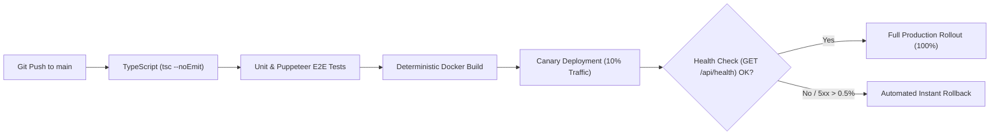

# REL-001 — CI/CD & Release Strategy

| Metadata Attribute | Value |
| :--- | :--- |
| **Document ID** | REL-001 |
| **Title** | Zyvoriq CI/CD Pipeline, Deployment Strategy & Rollback Runbook |
| **Owner** | DevOps / Release Lead |
| **Approvers** | CTO, VP of Engineering |
| **Version** | 1.0.0 |
| **Status** | Approved |
| **Priority** | P0 |
| **Created Date** | 2026-08-23 |
| **Last Reviewed Date** | 2026-08-23 |
| **Quality Gate** | QG-REL-01 (Release Strategy Approved) |
| **Assurance Score** | 98/100 |

---

## 1. CI/CD Deployment Pipeline

- **Zero-Downtime Deployments**: Rolling container replacement with health check verification (`GET /api/health`).
- **Instant Rollback**: Automated 1-command rollback if HTTP 5xx error rate exceeds $0.5\%$ over 2 minutes.

---

## 2. Document Sign-off (QG-REL-01)

- [x] Automated CI/CD pipeline and canary deployment runbook approved.

**Exit Status:** `RELEASE STRATEGY APPROVED (PASS)`
