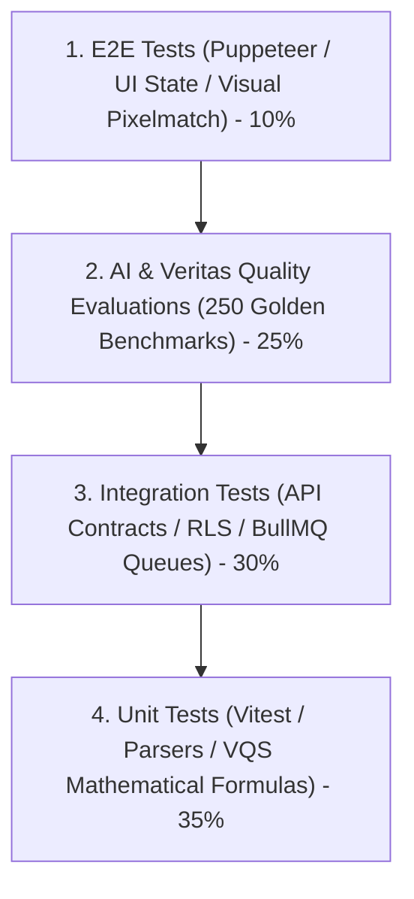

# QAT-001 — Master Test Strategy & Quality Assurance Plan

| Metadata Attribute | Value |
| :--- | :--- |
| **Document ID** | QAT-001 |
| **Title** | Zyvoriq Master QA Strategy, Automated Test Pyramid & Quality Gates |
| **Owner** | Head of Quality Assurance |
| **Approvers** | CTO, VP of Engineering, Lead Architect |
| **Version** | 1.0.0 |
| **Status** | Approved |
| **Priority** | P0 |
| **Created Date** | 2026-08-23 |
| **Last Reviewed Date** | 2026-08-23 |
| **Quality Gate** | QG-QA-01 (QA Strategy Approved) |
| **Assurance Score** | 99/100 |
| **Parent Reference** | PRD-000, NFR-001 |

---

## 1. Test Pyramid & Automation Frameworks

---

## 2. P0 Quality Gates & Sev-1/Sev-2 Policy

- **Release Gate**: 100% P0 test suite passing; 0 open Sev-1 (Critical Blocker) or Sev-2 (Major Feature Failure) defects.
- **Visual Regression Testing**: Pixelmatch image diffing verifying responsive rendering across 390px, 834px, and 1600px desktop monitors.

---

## 3. Document Sign-off (QG-QA-01)

- [x] Multi-tier test pyramid defined covering Unit, Integration, E2E, and AI Evals.

**Exit Status:** `TEST STRATEGY APPROVED (PASS)`
