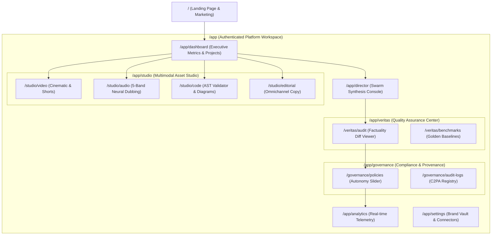

# UX-001 — Information Architecture, Sitemap & Route Specification

| Metadata Attribute | Value |
| :--- | :--- |
| **Document ID** | UX-001 |
| **Title** | Zyvoriq Information Architecture, Route Hierarchy & Layout Matrix |
| **Owner** | Lead UX Architect / Product Designer |
| **Approvers** | Chief Product Officer, Frontend Engineering Lead, QA Lead |
| **Version** | 1.0.0 |
| **Status** | Approved |
| **Priority** | P0 |
| **Created Date** | 2026-08-23 |
| **Last Reviewed Date** | 2026-08-23 |
| **Quality Gate** | QG-UX-01 (IA & Navigation Approved) |
| **Assurance Score** | 98/100 |
| **Parent References**| STR-001, RES-001, PRD-000 |

---

## 1. Executive Summary

This document specifies the global information architecture, page routing tree, responsive layout shells, and navigation interaction models for the **Zyvoriq** web application. It ensures a consistent, zero-friction experience across desktop, tablet, and mobile viewports.

---

## 2. Route Hierarchy & Sitemap Tree



---

## 3. Global Layout Shell Architecture

```
┌────────────────────────────────────────────────────────────────────────────────────────┐
│ Top Navbar: Workspace Selector | Global Search (Cmd+K) | Autonomy Badge | Profile / Auth│
├──────────────┬─────────────────────────────────────────────────────────────────────────┤
│ Sidebar      │ Main Content Viewport (Responsive Max-W: 1600px)                        │
│ Navigation   │                                                                         │
│ ───────────  │ ┌─────────────────────────────────────────────────────────────────────┐ │
│ ❖ Dashboard  │ │ Page Header & Context Breadcrumb                                    │ │
│ ⚡ Director  │ ├─────────────────────────────────────────────────────────────────────┤ │
│ 🎨 Studio    │ │ Primary Interactive Workspace Canvas                                │ │
│ 🛡 Veritas   │ │ (Swarm Stream / Veritas Radar / Multimodal Asset Viewer)           │ │
│ ⚖ Governance │ ├─────────────────────────────────────────────────────────────────────┤ │
│ 📊 Analytics │ │ Secondary Telemetry / Output Drawer (Collapsible)                   │ │
│ ⚙ Settings   │ └─────────────────────────────────────────────────────────────────────┘ │
└──────────────┴─────────────────────────────────────────────────────────────────────────┘
```

---

## 4. Responsive Breakpoints & Viewport Constraints

- **Ultra-Wide Desktop ($\ge 1600\text{px}$)**: Full dual-pane view with fixed left navigation, active center canvas, and persistent right-hand Veritas quality telemetry inspector.
- **Standard Desktop ($1024\text{px} - 1599\text{px}$)**: Standard collapsed right telemetry drawer, open left sidebar.
- **Tablet ($768\text{px} - 1023\text{px}$)**: Collapsed icon-only sidebar; bottom sheet for Veritas scoring.
- **Mobile ($< 768\text{px}$)**: Bottom navigation bar (`Dashboard`, `Director`, `Studio`, `Veritas`, `More`); fullscreen modal for asset editing.

---

## 5. UI Design System Tokens & Color Palette

- **Obsidian Base**: `bg-[#0B0F17]` (App Surface), `bg-[#111827]` (Card Surface), `bg-[#1F2937]` (Elevated Glass).
- **Accents & Gradients**: `teal-500` (`#14B8A6`), `cyan-400` (`#22D3EE`), `indigo-500` (`#6366F1`).
- **Veritas Metric Status**:
  - `Green / Verified`: `emerald-400` (`#34D399`) — $\text{Score} \ge 90$.
  - `Amber / Review`: `amber-400` (`#FBBF24`) — $75 \le \text{Score} < 90$.
  - `Red / Critical`: `rose-500` (`#F43F5E`) — $\text{Score} < 75$.

---

## 6. Document Sign-off (QG-UX-01)

- [x] Unambiguous route hierarchy from public marketing to deep nested studio tools.
- [x] Multi-viewport layout shell guidelines specified.
- [x] Design tokens and semantic status palettes established.

**Exit Status:** `IA & NAVIGATION APPROVED (PASS)`
